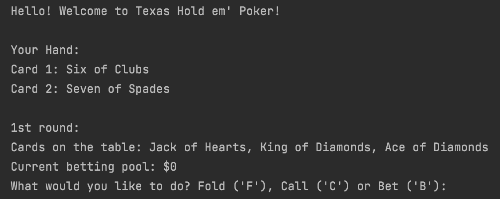

# PokerSimulator
This Project is still in progress, but this is the beginnings of a Texas Hold'em Poker simulator using C++!

### So far, it:
- Can create instances of a Player class
- Can randomly generate cards
- Can keep track of the cards in play
- Has functions for the beginnings of 3 rounds of the game
- Can keep track of bets

## How it looks so far:
1. This is how the program starts up:

  

2. After a few rounds:

  

3. Finally the round ends and shows the 'Used Cards Matrix' (Rows = Hearts, Diamonds, Clubs, Spades / Columns = 2 - Ace).
The matrix uses 1's and 0's to indicate whether the card has been used or not. The reason there are 13 cards used and not just the 5 on the table plus
the 2 in your hand is because the program also creates 3 other instances of the Player class meant to be stand-ins for CPU's, all of which get two cards 
of their own.

  

Thank you for checking out my project!
